# main-project-pickyours 

<br/>
  
### 의류 정보 및 유저 소셜서비스를 통합한 개인 프로젝트 입니다.
 ## 23.02.27 Update - 이제 Https 로 접속 가능합니다.
## <https://www.pickyours.co.kr>

게시글 저장과 모든 수정/삭제 기능을 사용하기 위해선 ADMIN 계정이 필요합니다.

임시 ID    :  admin

임시 Pwd : 관리자12!
 
 계정을 사용해주세요. 감사합니다.
##
<br/>
 <br/>
    <br/>
     


## Contacts

 이메일 주소
 
 sh5814367@gmail.com
 
 H.P.
 
 010 - 2217 - 4367
 
 BLOG
 
 <https://pyogowoon.tistory.com/>
 
 GITHUB
 
 <https://github.com/pyogowoon>
 
  <br/>
    <br/>
      <br/>
 
 
##

# 개요

- 프로젝트 명칭 : Pickyours 

- 개발 기간 :  2023 01.02 ~ 2023 02.23 

- 개인 프로젝트 

- 서비스 간단 소개 :  

 이 서비스의 주요 기능은 블로그 + 소셜 서비스 입니다.
 사용자는 원하는 정보를 블로그 시스템을 통해 간편히 찾을 수 있고, 소셜 서비스를 통하여 상호간의 소통으로도
 원하는 정보를 찾을 수 있습니다.
- 주요 기능 : 

  * 유저마당 : CRUD 기능, 스크롤 페이징 전략, 검색기능, 구독ㆍ좋아요ㆍ댓글 등 간단한 소셜 서비스
  
  * 게시글 : CRUD 기능, 페이징, 검색기능, 좋아요ㆍ댓글, 업로드 기능
  
  * 사용자 : Security 회원가입 및 로그인 , OAuth2.0 네이버, 카카오 로그인, 회원 정보 수정 
  
  * 유효성 검사 : AOP 처리
 
 
<br/>
<br/>

# 2. 사용 기술
 ` Back-end `
 
- JAVA 11 
 
 
- Spring Boot 2.7.7 
 
 
- Gradle 7.6 

 
- Spring Security 

 
- Spring Data JPA 

 
- Oauth 2.0 
<br/>
 
 ` Front-end 
 `
 - Bootstrap 4
 
 - Javascript es6
 
 - jQuery 
  
<br/>

` Database `

- H2 

- MariaDB 

<br/>

` DevOps `

 - AWS
 
 - Linux
 
  <br/>
    <br/>
      <br/>
 
 

 
 
 
# 3. DB 설계 
 <details>
     <summary> <h3> ERD 이미지 펼치기 </h3> </summary>
 
 
 
 </details>
 
 
  <details>
     <summary> <h3> DB 구성 펼치기 </h3> </summary>
 
 
 
 
 
 
 
 
 
 
 
 
 
 
 
 
 
 
 
 

 
 </details>
 
  <br/>
    <br/>
      <br/>
 
 
 
 
 # 4. API 설계
 <details>
 <summary> <h3> API 설계 펼치기 </h3> </summary>
 
 
 
 
  
 
   
 
    
 
 
 </details>
 
  <br/>
    <br/>
      <br/>
 
 
 # 5. 기능 설명 ( 사진 )
 
 > Pickyours 의 기능은 크게 유저마당, 블로그 게시판 으로 나뉘어져있습니다.
 
  > 해당 기능 설명 란 에서는 사진 첨부를 통한 기능을 간단하게 설명합니다.
 
 
  <details> 
  
<summary> <H2> 사진 설명 펼치기 </H2> </summary>
  

   

  <details>
  
  <summary> <H2> INDEX , LOGIN 부분 펼치기 </H2> </summary>
   
  ## 1. INDEX
  
  <br/>
    <br/>
  
  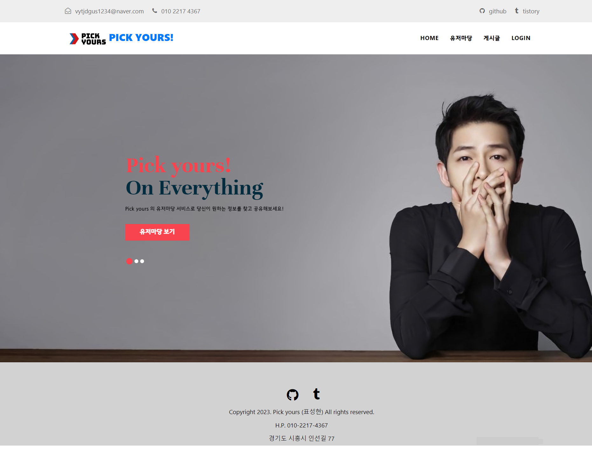
  
  
  <br/>
  
  > 인덱스입니다. Header와 Footer , 간단한 Carousel 기능 탑재했습니다.
  
  <br/>
    <br/>
      <br/>
  
  
  ## 2. 로그인
  
   <br/>
    <br/>
  
  
 
  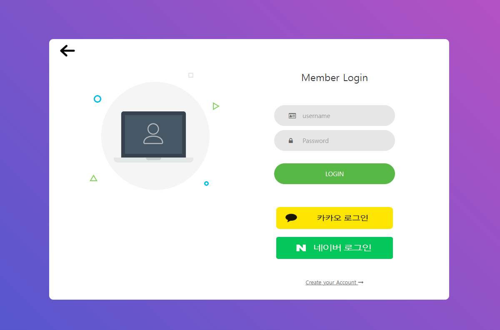
  
  > 로그인 입니다. 카카오톡 로그인, 네이버 로그인이 가능하며, 회원가입이 가능합니다.
  
   <br/>
    <br/>
      <br/>
 
 ## 2-1. 로그인 실패
 
   <br/>
    <br/>
  

  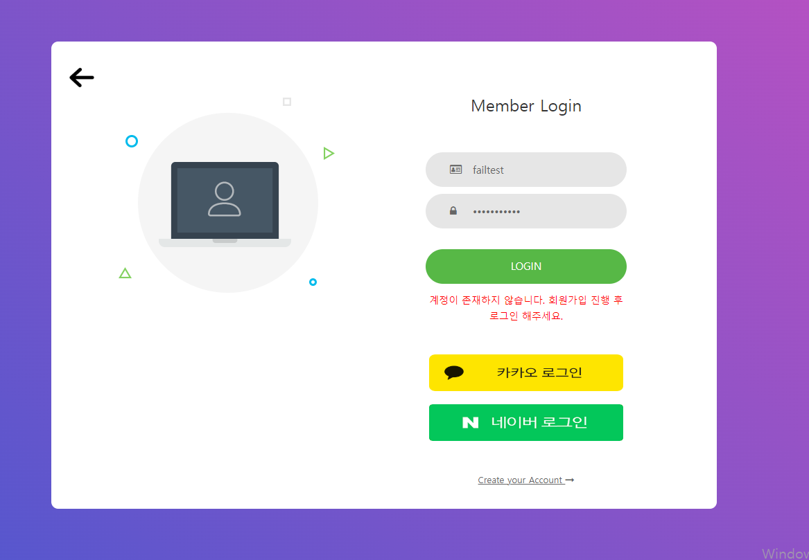


   
   > 로그인 실패 시 유효성 검사입니다. 간단한 경고문을 출력합니다.
   
   <br/>
    <br/>
      <br/>
   
 ## 2-2. 회원가입
 
   <br/>
    <br/>
  
   
  
  
  > 회원가입 입니다. 실패 시 유효성 검사 후 간단한 경고문 출력합니다.
  
   <br/>
    <br/>
      <br/>
  
 </details>
 
  <br/>
    <br/>
      <br/>
 
 
 <details>
 
 <summary> <H2> 유저마당 부분 펼치기 </H2> </summary>
  
  
 ## 3. 유저마당
 
   <br/>
    <br/>
  
 
 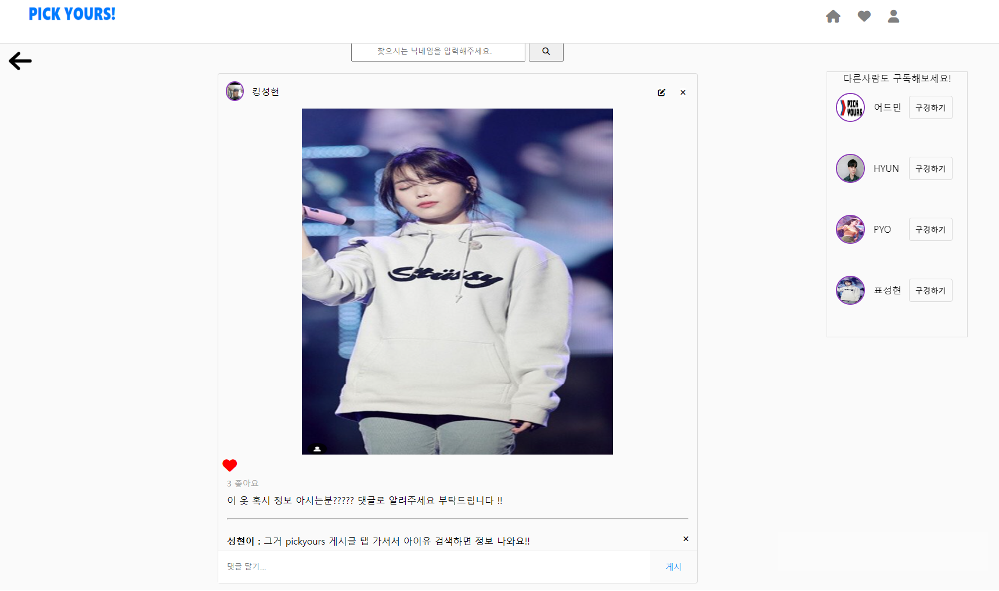
 
  > 유저마당 메인 입니다. 회원부터 사용 가능하며 유저 상호간의 소통이 가능합니다.
  
  > 사진 클릭 시 상세보기 페이지로 이동하며, 우측 상단 아이콘을 통해 유저마당메인페이지 / 인기사진페이지 / 프로필페이지 로 이동 가능합니다.
  
  > 검색 , 댓글 , 좋아요, 게시글 수정, 게시글 삭제 기능을 사용할 수 있으며 스크롤페이징 전략을 사용했습니다.
  
  > 또한 우측 메뉴바에서 랜덤한 유저의 페이지에 접근할 수 있습니다.
  
  <br/>
    <br/>
      <br/>
  
  
 ## 3-1. 유저마당 프로필 페이지
 
   <br/>
    <br/>
  
 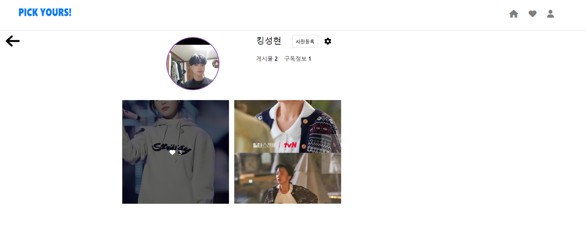
 
  
 > 프로필 페이지 입니다.
 
 > 해당 유저가 올린 이미지를 간략히 볼수있고, 클릭 시 상세보기 페이지로 이동합니다.
 
 > 또한 게시글의 좋아요 갯수, 해당 유저가 올린 게시글의 갯수, 해당 유저의 구독 정보를 볼 수 있습니다.
 
  <br/>
    <br/>
      <br/>
 
 
 
 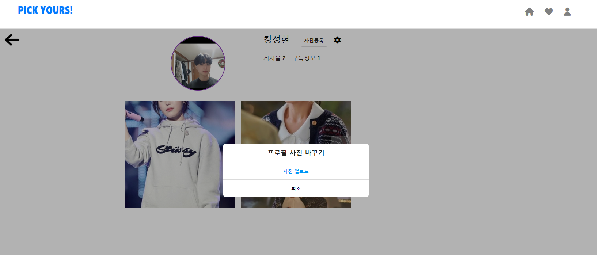

 
  > 프로필 사진 클릭 시 프로필 사진 변경이 가능합니다. 그 외 회원정보 수정, 사진 등록을 통한 게시글 등록이 가능합니다.
  
  <br/>
    <br/>
      <br/>
  
  ## 3-2. 유저마당 프로필 변경 페이지
  
   <br/>
    <br/>
  
  
 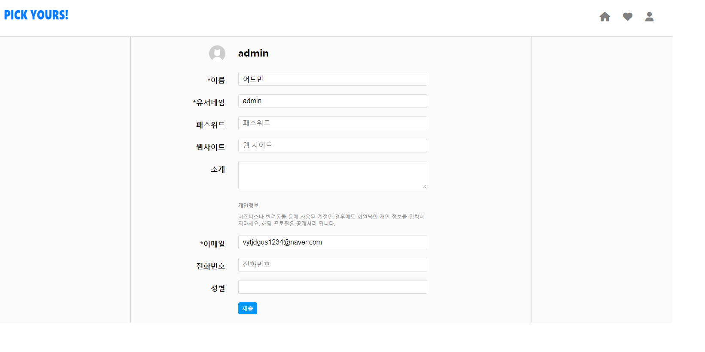
 
 > 회원 정보 변경입니다. *로 표시된 Not Null처리된 데이터를 제외한 데이터는 자유롭게 변경 가능합니다.
 
  <br/>
    <br/>
      <br/>
 
 
 ## 3-3. 유저마당 게시글 업로드 페이지
 
   <br/>
    <br/>
  
 
 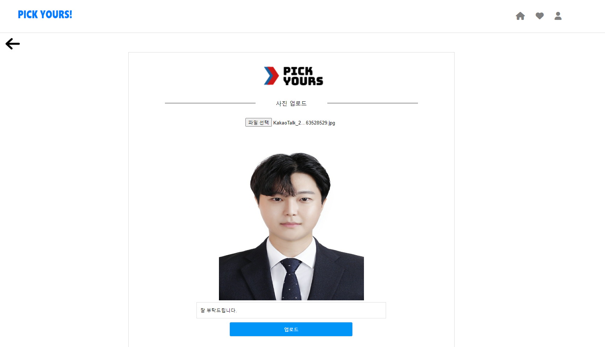
 
 > 게시글 업로드 페이지입니다. 사진과 함께 간단한 텍스트를 입력할 수 있습니다.
 
  <br/>
    <br/>
      <br/>
 
 ## 3-4. 유저마당 게시글 수정 페이지
 
   <br/>
    <br/>
  
 
 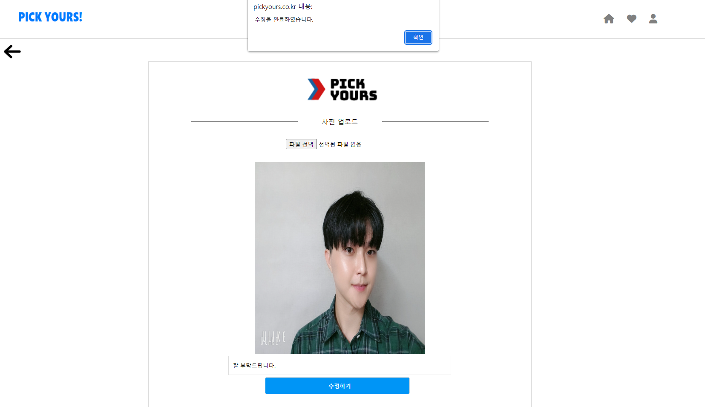
 
 
 
 > 게시글 수정 페이지 입니다. 사진만 수정 / 텍스트만 수정/ 모두 수정 이 가능하며 수정 시 간단한 alert창을 띄웠습니다.
 
  <br/>
    <br/>
      <br/>
 
 ## 3-5. 유저마당 게시글 삭제
 
   <br/>
    <br/>
  
 
  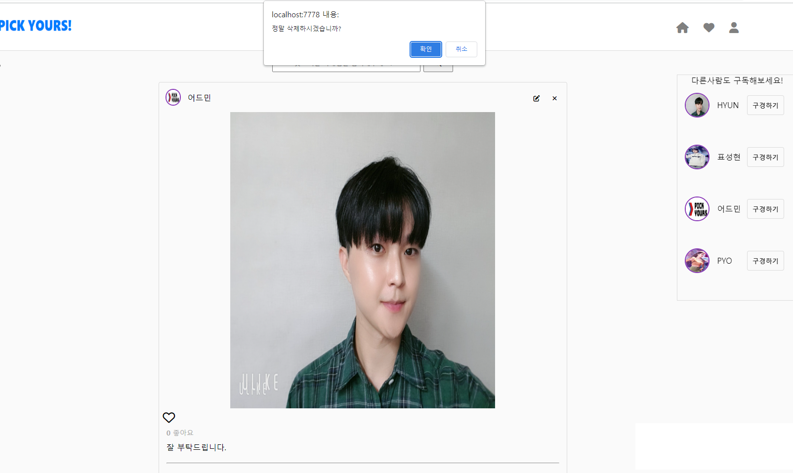
  
  > 게시글 삭제 입니다. 간단한 Confirm 창을 띄워 동의를 구한 후 삭제합니다.
  
   <br/>
    <br/>
      <br/>
  
  
  </details>
  
   <br/>
    <br/>
      <br/>
  
  
  <details>
  
  <summary> <h2> 블로그 게시판 부분 펼치기 </h2> </summary>
  
  
  
## 4. 게시판 페이지

  <br/>
    <br/>
  


> 페이징 기능 적용
  > 게시판 페이지 까지는 비 로그인 유저도 진입 가능합니다. 
    > 게시글 등록과 수정 및 삭제는 ADMIN 만이 권한을 가집니다.

 <br/>
    <br/>
      <br/>


## 4-1. 게시판 상세보기

  <br/>
    <br/>
  


> 로그인 한 유저는 게시판 상세보기에 접근 가능합니다.
  > 비디오로 짧은 영상을 볼수있습니다.


 <br/>
    <br/>
      <br/>


## 4-2. 게시판 상세보기의 비디오 토글

  <br/>
    <br/>
  

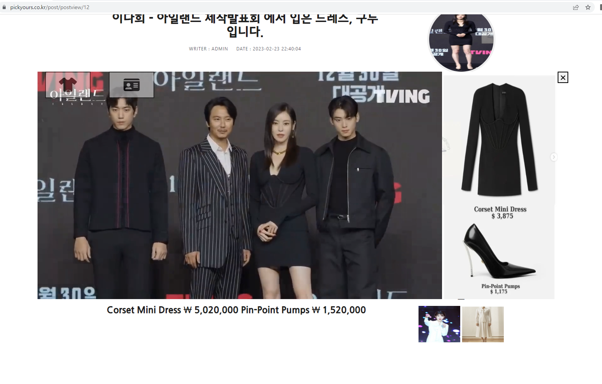

> 비디오 재생을 클릭 시 나오는 토글입니다.
  > 좌측 상단을 통해 옷 정보와 인물 정보를 토글 형태로 볼수있습니다. 토글된 형태는 영상 우측에 붙어서 나타납니다.


 <br/>
    <br/>
      <br/>


## 4-3. 게시판 저장하기 

  <br/>
    <br/>
  


> ADMIN 권한을 가진 유저가 게시판을 저장합니다.
  > 모든 항목은 Not Null 처리되어있습니다, 이를 충족하지 못할 시 Alert창이 실행됩니다.
    > 사진과 영상 첨부는 미리보기를 통해 볼 수 있습니다.


</details>

  
  </details>
  
  
  <br/>
    <br/>
      <br/>


 
 
 
 
 

 # 6. 기능 하이라이트
 
 > 중요한 기능을 설명과 코드를 함께 적었습니다.
 
  > 또한 리팩터링 한 코드는 리팩터링 과정도 함께 적었습니다.
 
<details>
 <summary> <H2>블로그 포스팅 </h2></summary> 

<!-- summary 아래 한칸 공백 두어야함 -->
## 1. 멀티파츠 첨부기능
블로그 포스팅 서비스에서 가장 중요한 부분인 멀티파츠 저장 기능입니다.
이 기능을 만들기 위해 크게 2가지를 고려했습니다. 
 - text + textarea + file 타입,  다중타입 을 Ajax를 통해 보낼것. 
 - file 타입을 총 3가지 ( 사진, 사진, 동영상) 보내야하기 때문에 용량이 많이 발생할것이므로 외부에 업로드 폴더를 둬야했습니다. 
 
 -첫번째로 ajax 입니다.    [코드링크 : postsave.js](https://github.com/Pyogowoon/main-project-pickyours/blob/master/src/main/resources/static/js/post/postsave.js)
 
 ```javascript
 // (1) 게시글 저장하기
function postSave(userId) {

    let data = $("#postSave")[0];

    let formData = new FormData(data);

    $.ajax({
        type: "post",
        data: formData,
        url: "/api/post",
        contentType: false,
        processData: false,
        enctype: "multipart/form-data",
        dataType: "json"

    }).done(res => {

       location.href = "/post";

    }).fail(error => {

        alert("모든 항목을 입력해야 저장 가능합니다.");

    });

}
```
 다중타입으로 보내기 위해 formdata 객체에 담아 데이터를 전송했고
  실패시 alert를 이용하여 에러 발생시 알림을 리턴합니다.
  <br/>
  <br/>
  
  그 후 2번째 조건인 외부 폴더에 파일을 업로드 하기위해 
  yml에 외부 폴더 경로를 적어준 후 Configuration 어노테이션을 사용하여
   빈을 수동으로 등록.
  
  ```java

@Configuration
public class WebMvcConfig implements WebMvcConfigurer {
    /* yml에 적힌 경로 */
    @Value("${file.path}")
    private String uploadFolder;

    /* 파일 업로드 핸들러 */
    @Override
    public void addResourceHandlers(ResourceHandlerRegistry registry) {
        WebMvcConfigurer.super.addResourceHandlers(registry);

        registry
                .addResourceHandler("/upload/**")
                .addResourceLocations("file:///" + uploadFolder)
                .setCachePeriod(60*10*6) // 1시간동안 캐싱
                .resourceChain(true)
                .addResolver(new PathResourceResolver());
    }

}
}  
  ```
  
 - 그 후 PostDto 로 데이터 받아와서 Service 단으로 넘김. [코드링크 : PostService ](https://github.com/Pyogowoon/main-project-pickyours/blob/master/src/main/java/com/pyo/yourspick/service/PostService.java)
   
   
   - DB에 저장 될 파일의 URL 이 중복되는것을 방지하기 위해 UUID값을 부여해주었고
    빈으로 등록한 경로를 찾고 Byte화 해서 저장하였습니다.
  
  ```java
   @Value("${file.path}")
    private String uploadFolder;

    /* 게시글 저장 */
    @Transactional
    public Post 게시글저장(PostDto postDto, PrincipalDetails principalDetails
            , MultipartFile clotheImage, MultipartFile actorImage, MultipartFile video) {

        /* 중복 방지용 임의 값 부여 */
        UUID uuid = UUID.randomUUID();
        String actorImageFileName = uuid + "_" + actorImage.getOriginalFilename();
        String clotheImageFileName = uuid + "_" + clotheImage.getOriginalFilename();
        String videoFileName = uuid + "_" + video.getOriginalFilename();

        /* 파일의 경로 찾기 */
        Path actorImageFilePath = Paths.get(uploadFolder + actorImageFileName);
        Path clotheImageFilePath = Paths.get(uploadFolder + clotheImageFileName);
        Path videoFilePath = Paths.get(uploadFolder + videoFileName);

        /* 지정한 경로에 Byte화 해서 저장 */
        try {
            Files.write(actorImageFilePath, actorImage.getBytes());
            Files.write(clotheImageFilePath, clotheImage.getBytes());
            Files.write(videoFilePath, video.getBytes());
        } catch (Exception e) {
            e.printStackTrace();

        }
        /* Builder 패턴 실행 */
        User user = principalDetails.getUser();
        Post post = postDto.toEntity(user, actorImageFileName, clotheImageFileName, videoFileName);

        return postRepository.save(post);

    }
  ```
  
  ## 2. 멀티파츠 수정기능
   두번째로 중요하다고 생각한 로직인 멀티파츠 수정 기능입니다. <br/>
    기본적으로 멀티파츠 저장기능과 구현 로직은 동일합니다. 하지만
  멀티파츠 수정기능을 구현하면서 리팩터링 고민에 빠지게되었습니다.
  <br/>
   수정기능은 2가지의 조건을 고려하면서 기능을 구현했습니다.
   
   - JPA 고유의 업데이트 방식인 Dirty Checking 을 활용하고자 했습니다.
   - Dirty Checking을 활용하는 과정에서, Entity에 직접적으로 Setter를 사용하지 않기 입니다.
   
   
  ## 2-1. 리팩터링 전 멀티파츠 수정기능 코드
  - PostApiController
    
    
    
    
    ```java
    
     /* 게시글 수정 기능 */
    @PutMapping("/api/post/{postId}")
    public ResponseEntity<?> postUpdate(PostUpdateDto postUpdateDto, @AuthenticationPrincipal PrincipalDetails principalDetails,
                                        @PathVariable int postId) {

        /* 멀티파트파일 getData 값 */
        MultipartFile actorImage = postUpdateDto.getActorImage();
        MultipartFile clotheImage = postUpdateDto.getClotheImage();
        MultipartFile video = postUpdateDto.getVideo();

    
        Post postEntity = postService.게시글수정(postUpdateDto.toEntity(), actorImage, clotheImage, video, principalDetails, postId);

        return new ResponseEntity<>(new CMRespDto<>(1, "수정 성공", postEntity), HttpStatus.OK);
    }
    
    
    ```
    > Service로 보낼 때, Dto의 Builder 패턴을 구현한 toEntity() 로 보냈습니다.
    
    <br/>
      <br/>
        <br/>
  - PostService
   
   ```java
  /* 게시글 수정 */
    @Transactional
    public Post 게시글수정(Post post, MultipartFile actorImage,
                      MultipartFile clotheImage, MultipartFile video, PrincipalDetails principalDetails, int postId) {

        /* 게시글의 ID찾기 */
        Post postEntity = postRepository.findById(postId).orElseThrow(() -> {
            throw new CustomApiException("아이디를 찾을 수 없습니다.");
        });


        /* 중복 방지용 임의 값 부여 */
        UUID uuid = UUID.randomUUID();
        String actorImageFileName = uuid + "_" + actorImage.getOriginalFilename();
        String clotheImageFileName = uuid + "_" + clotheImage.getOriginalFilename();
        String videoFileName = uuid + "_" + video.getOriginalFilename();

        /* 파일의 경로 찾기 */
        Path actorImageFilePath = Paths.get(uploadFolder + actorImageFileName);
        Path clotheImageFilePath = Paths.get(uploadFolder + clotheImageFileName);
        Path videoFilePath = Paths.get(uploadFolder + videoFileName);

        /* 지정한 경로에 Byte화 해서 저장 */
        try {
            Files.write(actorImageFilePath, actorImage.getBytes());
            Files.write(clotheImageFilePath, clotheImage.getBytes());
            Files.write(videoFilePath, video.getBytes());
        } catch (Exception e) {
            e.printStackTrace();

        }

        /* 게시글 수정 로직 */
        User userEntity = principalDetails.getUser();


        postEntity.setUser(userEntity);
        postEntity.setTitle(post.getTitle());
        postEntity.setContent(post.getContent());
        postEntity.setEntryTitle(post.getEntryTitle());
        postEntity.setActor(post.getActor());
        postEntity.setJob(post.getJob());
        postEntity.setHeight(post.getHeight());
        postEntity.setWeight(post.getWeight());


        /* actorImage 변경 감지 */
        if (!actorImage.getOriginalFilename().isEmpty()) {
            postEntity.setPostImageUrlLeft(actorImageFileName.toString());

        }

        /* clotheImage 변경 감지 */
        if (!clotheImage.getOriginalFilename().isEmpty()) {

            postEntity.setPostImageUrlRight(clotheImageFileName.toString());
        }
        
        /* video 변경 감지 */
        if (!video.getOriginalFilename().isEmpty()) {

            postEntity.setPostVideoUrl(videoFileName.toString());
        }

        return postEntity;


    }
    
   ```
   
  
   - 게시글 수정 로직 에서 Entity 인 Post에 직접적으로 Setter 를 사용하는 것이 클린한 코드가 맞는지 의문이 들었습니다.
   
   - Setter를 무조건 안쓰겠다 는 생각보다, 여러가지의 데이터를 다룰 때 Setter 사용을 지양하고자 했습니다.
    
   - 이유는 객체의 일관성과 명확성을 위해 리팩터링을 진행했습니다.
    
    
    
 ## 2-2. 리팩터링 후 멀티파츠 수정기능 코드
    
   - Post (domain)
   
   
   ```java
    
   
                                                   .
                                                   .
                                                   .
                                                   .
                                                   .

        
     public void update(User user, String title, String content, String entryTitle, String entryContent
            , String actor, String job, String height, String weight) {
        this.user = user;
        this.title = title;
        this.content = content;
        this.entryTitle = entryTitle;
        this.entryContent = entryContent;
        this.actor = actor;
        this.job = job;
        this.height = height;
        this.weight = weight;

    }
    public void leftImageUpdate(String postImageUrlLeft){
        this.postImageUrlLeft = postImageUrlLeft;

    }
    public void rightImageUpdate(String postImageUrlRight){
        this.postImageUrlRight = postImageUrlRight;

    }
    public void videoUpdate(String postVideoUrl){
        this.postVideoUrl = postVideoUrl;
    }


```

  
  
  - Post 도메인에 update 관련 메서드를 추가했습니다, 최대한 분명한 의도를 보일 수 있는 이름으로 지었습니다.
  
  <br/>
      <br/>
        <br/>
        
  - PostService
  
  ```java
  
                                              .
                                              .
                                              .
                                              .
  
   /* 게시글 수정 로직 */
        User userEntity = principalDetails.getUser();

        postEntity.update(
                userEntity,
                postUpdateDto.getTitle(),
                postUpdateDto.getContent(),
                postUpdateDto.getEntryTitle(),
                postUpdateDto.getEntryContent(),
                postUpdateDto.getActor(),
                postUpdateDto.getJob(),
                postUpdateDto.getHeight(),
                postUpdateDto.getWeight()
        );

        /* actorImage 변경 감지 */
        if (!actorImage.getOriginalFilename().isEmpty()) {

            postEntity.leftImageUpdate(actorImageFileName);
        }

        /* clotheImage 변경 감지 */
        if (!clotheImage.getOriginalFilename().isEmpty()) {

            postEntity.rightImageUpdate(clotheImageFileName);
        }

        /* video 변경 감지 */
        if (!video.getOriginalFilename().isEmpty()) {

            postEntity.videoUpdate(videoFileName);
        }

        return postEntity;
    }
    
 ```
 
 - Setter 를 사용하는 대신, post.update() 메서드를 사용하는것으로 리팩터링 하였습니다.
 - File 역시 의도를 알수있도록 네이밍을 해서 메서드를 구현하였습니다.
 
 
 

</details>

<details>
 <summary> <h2> 소셜 서비스 </h2> </summary>
 
 
 내용
 </details>
  
  <details>
 <summary> <h2> 유효성 검사 </h2> </summary>
 
 
 내용
 </details>
  
  


 ## 7. Troubleshooting
 <br/>
 
 ## 8. 향후 개선 방안
 
  DB 테이블 설계에서 FK 사용이 너무 잦음 - > JOIN 키로 바꿀 수 있도록
  DTO의 Response , Request 분리 필요 -> dto 정적팩토리 메소드를 쓸건지 Entity에 메서드를 만들것인지?
  
  
 
