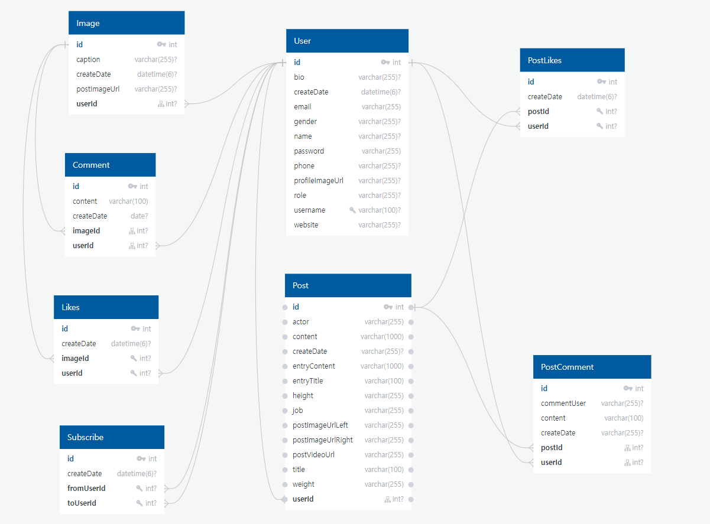
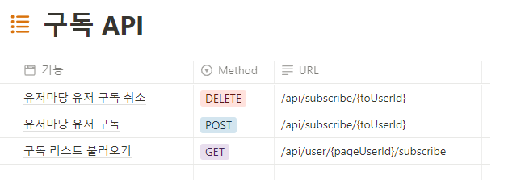
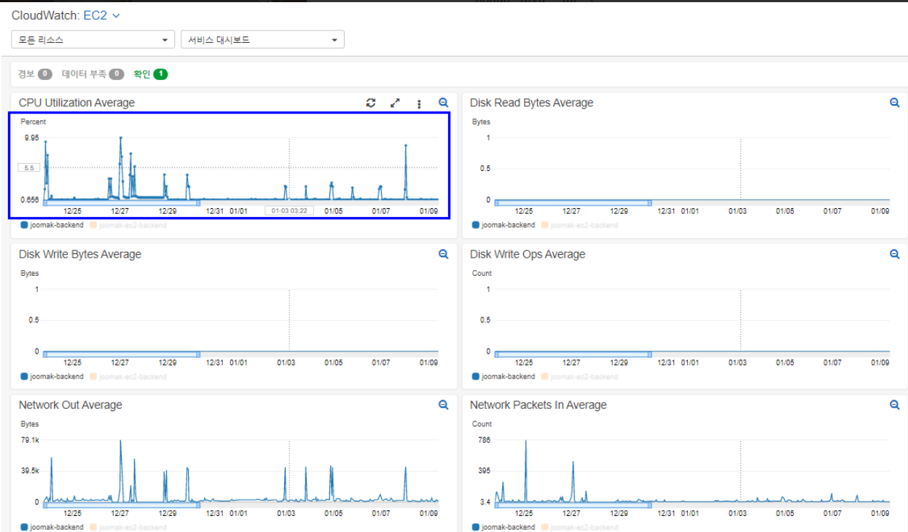

# main-project-pickyours 

<br/>
  
### 의류 정보 및 유저 소셜서비스를 통합한 개인 프로젝트 입니다.

<br/>
  <br/>
  
 ## 23.02.27 Update - Https 로 접속 가능합니다.
 
## <https://www.pickyours.co.kr>

게시글 저장과 모든 수정/삭제 기능을 사용하기 위해선 ADMIN 계정이 필요합니다.

임시 ID    :  admin

임시 Pwd : 관리자12!
 
 계정을 사용해주세요. 감사합니다.
 
 <br/>  
  <br/>
 
 단순한 이용을 원하시면 소셜로그인으로 충분합니다.

<br/>
 <br/>
    <br/>
     
 


# 1. 개요

<br/>


- 프로젝트 명칭 : Pickyours 

- 개발 기간 :  2023 01.02 ~ 2023 02.27 

- 개인 프로젝트 

- 서비스 간단 소개 :  

 이 서비스의 주요 기능은 게시판 + 소셜 서비스 입니다.
 사용자는 원하는 정보를 게시판 시스템을 통해 간편히 찾을 수 있고, 소셜 서비스를 통하여 상호간의 소통으로도
 원하는 정보를 찾을 수 있습니다.
- 주요 기능 : 

  * 유저마당 : CRUD 기능, 스크롤 페이징 전략, 검색기능, 구독ㆍ좋아요ㆍ댓글 등 간단한 소셜 서비스
  
  * 게시글 : CRUD 기능, 페이징, 검색기능, 좋아요ㆍ댓글, 업로드 기능
  
  * 사용자 : Security 회원가입 및 로그인 , OAuth2.0 네이버, 카카오 로그인, 회원 정보 수정 
  
  * 유효성 검사 : AOP 처리
  
  * 기타 : XSS 공격 방지 필터
 
 
<br/>
<br/>

# 2. 사용 기술
 ` Back-end `
 
- JAVA 11 
 
 
- Spring Boot 2.7.7 
 
 
- Gradle 7.6 

 
- Spring Security 

 
- Spring Data JPA 

 
- Oauth 2.0 
<br/>
 
 ` Front-end 
 `
 - Bootstrap 4
 
 - Javascript es6
 
 - jQuery 
  
<br/>

` Database `

- H2 

- MariaDB 

<br/>

` DevOps `

 - AWS
 
 - Linux
 
  <br/>
    <br/>
      <br/>
 
 

 
 
 
# 3. DB 설계 
> 프로젝트의 데이터베이스 ERD 와 전체적인 구성 입니다.

<br/>
  <br/>
 <details>
     <summary> <h2> ERD 이미지 펼치기 </h2> </summary>
 
 
 
 </details>
 
 
  <details>
     <summary> <h2> DB 구성 펼치기 </h2> </summary>
 
 
 
 
 
 
 
 
 
 
 
 
 
 
 
 
 
 
 
 

 
 </details>
 
  <br/>
    <br/>
      <br/>
 
 
 
 
 # 4. API 설계
 > 프로젝트의 API 설계도 입니다.
 
 <br/>
  <br/>
 <details>
 <summary> <h2> API 설계 펼치기 </h2> </summary>
 
 
 
 
  
 
   
 
    
 
 
 </details>
 
  <br/>
    <br/>
      <br/>
 
 
 # 5. 기능 설명 (사진과 GIF)
 
 > Pickyours 의 기능은 크게 유저마당, 블로그 게시판 으로 나뉘어져있습니다.
 
  > 해당 기능 설명 란 에서는 사진 첨부를 통한 기능을 간단하게 설명합니다.
  
   <br/>
  <br/>
 
 
  <details> 
  
<summary> <H2> 사진 설명 펼치기 </H2> </summary>
  <hr/>
  
  <br/>
    <br/>
  

   

  <details>
  
  <summary> <H2> INDEX , LOGIN 부분 펼치기 </H2> </summary>
   
  ## 1. INDEX
  
  <br/>
    <br/>

    


  
  
  <br/>
  
  > 인덱스입니다. 간단한 Carousel 기능으로 컨텐츠를 안내합니다.
  
  <br/>
    <br/>
      <br/>
  
  
  ## 2. 로그인
  
   <br/>
    <br/>
  
  
 

  
  > 로그인 입니다. 카카오톡 로그인, 네이버 로그인이 가능하며, 회원가입이 가능합니다.
  
   <br/>
    <br/>
      <br/>
 
 ## 2-1. 로그인 실패
 
   <br/>
    <br/>
  

  


   
   > 로그인 실패 시 유효성 검사입니다. 상황에 맞는 간단한 경고문을 출력합니다.
   
   <br/>
    <br/>
      <br/>
   
 ## 2-2. 회원가입
 
   <br/>
    <br/>
  
   
  
  
  > 회원가입 입니다. 실패 시 유효성 검사 후 간단한 경고문 출력합니다.
  
   <br/>
    <br/>
      <br/>
  
 </details>
 
  <br/>
    <br/>
      <br/>
 
 
 <details>
 
 <summary> <H2> 유저마당 부분 펼치기 </H2> </summary>
  
  
 ## 3. 유저마당 메인
 
   <br/>
    <br/>
  
 

 
  > 유저마당 메인 입니다. 회원부터 사용 가능하며 유저 상호간의 소통이 가능합니다.
  
  
  > 검색 , 댓글 , 좋아요, 게시글 수정, 게시글 삭제 기능을 사용할 수 있으며 스크롤페이징 전략을 사용했습니다.
  
   <br/>
    <br/>
   

   
  > 우측 상단 네비게이션 바 를 이용하여 인기페이지, 내 프로필 페이지로 이동할 수 있습니다.
   
   <br/>
    <br/>
   

  
  > 우측 메뉴바로 무작위 유저의 프로필에 접근할 수 있습니다.
  
  <br/>
    <br/>
      <br/>
  
  
 ## 3-1. 유저마당 프로필 페이지
 
   <br/>
    <br/>
  

 
  
 > 해당 유저가 올린 이미지를 간략히 볼수있고, 클릭 시 상세보기 페이지로 이동합니다.
 
 >  해당 유저의 구독 정보를 볼 수 있으며, 유저의 게시글 좋아요 갯수를 볼 수 있습니다.
 
  <br/>
    <br/>
      <br/>
 
 
  <br/>
    <br/>
      <br/>
  
  ## 3-2. 유저마당 프로필 변경 페이지
  
   <br/>
    <br/>
  
  


 
 > 회원 정보 변경입니다. *로 표시된 Not Null처리된 데이터를 제외한 데이터는 자유롭게 변경 가능합니다.
 
  <br/>
    <br/>
      <br/>
 
 
 ## 3-3. 유저마당 게시글 업로드 페이지
 
   <br/>
    <br/>
  

 
 > 게시글 업로드 페이지입니다. 사진과 함께 간단한 텍스트를 입력할 수 있습니다.
 
  <br/>
    <br/>
      <br/>
 
 ## 3-4. 유저마당 게시글 수정 페이지
 
   <br/>
    <br/>
  
 

 
 
 
 > 게시글 수정 페이지 입니다. 사진만 수정 / 텍스트만 수정/ 모두 수정 이 가능하며 수정 시 간단한 alert창을 띄웠습니다.
 
  <br/>
    <br/>
      <br/>
 
 ## 3-5. 유저마당 게시글 삭제
 
   <br/>
    <br/>
  
 
 
  
  > 게시글 삭제 입니다. 간단한 Confirm 창을 띄워 동의를 구한 후 삭제합니다.
  
   <br/>
    <br/>
      <br/>
  
  
  </details>
  
   <br/>
    <br/>
      <br/>
  
  
  <details>
  
  <summary> <h2> 블로그 게시판 부분 펼치기 </h2> </summary>
  
  
  
## 4. 게시판 페이지

  <br/>
    <br/>
  


> 페이징 기능이 적용되어있으며, 게시판 페이지( 현재 페이지 ) 까지는 비 로그인 유저도 진입 가능합니다. 

  > 게시글 등록과 수정 및 삭제는 ADMIN 만이 권한을 가집니다.

 <br/>
    <br/>
      <br/>


## 4-1. 게시판 상세보기

  <br/>
    <br/>
  


> 로그인 한 유저는 게시판 상세보기에 접근 가능합니다.
  > 비디오로 짧은 영상을 볼수있습니다.


 <br/>
    <br/>
      <br/>


## 4-2. 게시판 상세보기의 비디오 토글

  <br/>
    <br/>
  


> 비디오 재생을 클릭 시 나오는 토글입니다.
  > 좌측 상단을 통해 옷 정보와 인물 정보를 토글 형태로 볼수있습니다. 토글된 형태는 영상 우측에 붙어서 나타납니다.


 <br/>
    <br/>
      <br/>


## 4-3. 게시판 저장하기 

  <br/>
    <br/>
  


> ADMIN 권한을 가진 유저가 게시판을 저장합니다.
    
 <br/>
     <br/>
    
 

    
 > 모든 항목은 Not Null 처리되어있습니다, 이를 충족하지 못할 시 Alert창이 실행됩니다.
    
  > 사진과 영상 첨부는 미리보기를 통해 볼 수 있습니다.
    
 <br/>
  <br/>
    
    
## 4-4. 게시판 수정하기 
    

<br/>
 <br/>
    
    
 
    
  
 > 게시글 수정입니다. 바꾸고 싶은 항목만 바꿀 수 있습니다.

 <br/>
  <br/>
    

## 4-4. 게시판 삭제하기 
    

  <br/>
    <br/>
    
 
    
 > 게시글 삭제하기 입니다. confirm을 통해 요청 후 삭제합니다.
    

</details>

  
  </details>
  
  
  <br/>
    <br/>
      <br/>
      <hr/>


 
 
 
 
 

 # 6. 기능 하이라이트
 
 > 중요한 기능을 설명과 코드를 함께 적었습니다.
 
  > 또한 리팩터링 한 코드는 리팩터링 과정도 함께 적었습니다.
  
  <br/>
    <br/>
 
<details>
 <summary> <H2>블로그 포스팅  </h2></summary> 

<!-- summary 아래 한칸 공백 두어야함 -->
## 1. 멀티파츠 첨부기능
블로그 포스팅 서비스에서 가장 중요한 부분인 멀티파츠 저장 기능입니다.
이 기능을 만들기 위해 크게 2가지를 고려했습니다. 
 - text + textarea + file 타입,  다중타입 을 Ajax를 통해 보낼것. 
 - file 타입을 총 3가지 ( 사진, 사진, 동영상) 보내야하기 때문에 용량이 많이 발생할것이므로 외부에 업로드 폴더를 둬야했습니다. 
 
 -첫번째로 ajax 입니다.    [코드링크 : postsave.js](https://github.com/Pyogowoon/main-project-pickyours/blob/master/src/main/resources/static/js/post/postsave.js)
 
 ```javascript
 // (1) 게시글 저장하기
function postSave(userId) {

    let data = $("#postSave")[0];

    let formData = new FormData(data);

    $.ajax({
        type: "post",
        data: formData,
        url: "/api/post",
        contentType: false,
        processData: false,
        enctype: "multipart/form-data",
        dataType: "json"

    }).done(res => {

       location.href = "/post";

    }).fail(error => {

        alert("모든 항목을 입력해야 저장 가능합니다.");

    });

}
```
 다중타입으로 보내기 위해 formdata 객체에 담아 데이터를 전송했고
  실패시 alert를 이용하여 에러 발생시 알림을 리턴합니다.
  <br/>
  <br/>
  
  그 후 2번째 조건인 외부 폴더에 파일을 업로드 하기위해 
  yml에 외부 폴더 경로를 적어준 후 Configuration 어노테이션을 사용하여
   빈을 수동으로 등록.
  
  ```java

@Configuration
public class WebMvcConfig implements WebMvcConfigurer {
    /* yml에 적힌 경로 */
    @Value("${file.path}")
    private String uploadFolder;

    /* 파일 업로드 핸들러 */
    @Override
    public void addResourceHandlers(ResourceHandlerRegistry registry) {
        WebMvcConfigurer.super.addResourceHandlers(registry);

        registry
                .addResourceHandler("/upload/**")
                .addResourceLocations("file:///" + uploadFolder)
                .setCachePeriod(60*10*6) // 1시간동안 캐싱
                .resourceChain(true)
                .addResolver(new PathResourceResolver());
    }

}
}  
  ```
  
 - 그 후 PostDto 로 데이터 받아와서 Service 단으로 넘김. [코드링크 : PostService ](https://github.com/Pyogowoon/main-project-pickyours/blob/master/src/main/java/com/pyo/yourspick/service/PostService.java)
   
   
   - DB에 저장 될 파일의 URL 이 중복되는것을 방지하기 위해 UUID값을 부여해주었고
    빈으로 등록한 경로를 찾고 Byte화 해서 저장하였습니다.
  
  ```java
   @Value("${file.path}")
    private String uploadFolder;

    /* 게시글 저장 */
    @Transactional
    public Post 게시글저장(PostDto postDto, PrincipalDetails principalDetails
            , MultipartFile clotheImage, MultipartFile actorImage, MultipartFile video) {

        /* 중복 방지용 임의 값 부여 */
        UUID uuid = UUID.randomUUID();
        String actorImageFileName = uuid + "_" + actorImage.getOriginalFilename();
        String clotheImageFileName = uuid + "_" + clotheImage.getOriginalFilename();
        String videoFileName = uuid + "_" + video.getOriginalFilename();

        /* 파일의 경로 찾기 */
        Path actorImageFilePath = Paths.get(uploadFolder + actorImageFileName);
        Path clotheImageFilePath = Paths.get(uploadFolder + clotheImageFileName);
        Path videoFilePath = Paths.get(uploadFolder + videoFileName);

        /* 지정한 경로에 Byte화 해서 저장 */
        try {
            Files.write(actorImageFilePath, actorImage.getBytes());
            Files.write(clotheImageFilePath, clotheImage.getBytes());
            Files.write(videoFilePath, video.getBytes());
        } catch (Exception e) {
            e.printStackTrace();

        }
        /* Builder 패턴 실행 */
        User user = principalDetails.getUser();
        Post post = postDto.toEntity(user, actorImageFileName, clotheImageFileName, videoFileName);

        return postRepository.save(post);

    }
  ```
  
  ## 2. 멀티파츠 수정기능
   두번째로 중요하다고 생각한 로직인 멀티파츠 수정 기능입니다. <br/>
    기본적으로 멀티파츠 저장기능과 구현 로직은 동일합니다. 하지만
  멀티파츠 수정기능을 구현하면서 리팩터링 고민에 빠지게되었습니다.
  <br/>
   수정기능은 2가지의 조건을 고려하면서 기능을 구현했습니다.
   
   - JPA 고유의 업데이트 방식인 Dirty Checking 을 활용하고자 했습니다.
   - Dirty Checking을 활용하는 과정에서, Entity에 직접적으로 Setter를 사용하지 않기 입니다.
   
   
  ## 2-1. 리팩터링 전 멀티파츠 수정기능 코드
  - PostApiController
    
    
    
    
    ```java
    
     /* 게시글 수정 기능 */
    @PutMapping("/api/post/{postId}")
    public ResponseEntity<?> postUpdate(PostUpdateDto postUpdateDto, @AuthenticationPrincipal PrincipalDetails principalDetails,
                                        @PathVariable int postId) {

        /* 멀티파트파일 getData 값 */
        MultipartFile actorImage = postUpdateDto.getActorImage();
        MultipartFile clotheImage = postUpdateDto.getClotheImage();
        MultipartFile video = postUpdateDto.getVideo();

    
        Post postEntity = postService.게시글수정(postUpdateDto.toEntity(), actorImage, clotheImage, video, principalDetails, postId);

        return new ResponseEntity<>(new CMRespDto<>(1, "수정 성공", postEntity), HttpStatus.OK);
    }
    
    
    ```
    > Service로 보낼 때, Dto의 Builder 패턴을 구현한 toEntity() 로 보냈습니다.
    
    <br/>
      <br/>
        <br/>
  - PostService
   
   ```java
  /* 게시글 수정 */
    @Transactional
    public Post 게시글수정(Post post, MultipartFile actorImage,
                      MultipartFile clotheImage, MultipartFile video, PrincipalDetails principalDetails, int postId) {

        /* 게시글의 ID찾기 */
        Post postEntity = postRepository.findById(postId).orElseThrow(() -> {
            throw new CustomApiException("아이디를 찾을 수 없습니다.");
        });


        /* 중복 방지용 임의 값 부여 */
        UUID uuid = UUID.randomUUID();
        String actorImageFileName = uuid + "_" + actorImage.getOriginalFilename();
        String clotheImageFileName = uuid + "_" + clotheImage.getOriginalFilename();
        String videoFileName = uuid + "_" + video.getOriginalFilename();

        /* 파일의 경로 찾기 */
        Path actorImageFilePath = Paths.get(uploadFolder + actorImageFileName);
        Path clotheImageFilePath = Paths.get(uploadFolder + clotheImageFileName);
        Path videoFilePath = Paths.get(uploadFolder + videoFileName);

        /* 지정한 경로에 Byte화 해서 저장 */
        try {
            Files.write(actorImageFilePath, actorImage.getBytes());
            Files.write(clotheImageFilePath, clotheImage.getBytes());
            Files.write(videoFilePath, video.getBytes());
        } catch (Exception e) {
            e.printStackTrace();

        }

        /* 게시글 수정 로직 */
        User userEntity = principalDetails.getUser();


        postEntity.setUser(userEntity);
        postEntity.setTitle(post.getTitle());
        postEntity.setContent(post.getContent());
        postEntity.setEntryTitle(post.getEntryTitle());
        postEntity.setActor(post.getActor());
        postEntity.setJob(post.getJob());
        postEntity.setHeight(post.getHeight());
        postEntity.setWeight(post.getWeight());


        /* actorImage 변경 감지 */
        if (!actorImage.getOriginalFilename().isEmpty()) {
            postEntity.setPostImageUrlLeft(actorImageFileName.toString());

        }

        /* clotheImage 변경 감지 */
        if (!clotheImage.getOriginalFilename().isEmpty()) {

            postEntity.setPostImageUrlRight(clotheImageFileName.toString());
        }
        
        /* video 변경 감지 */
        if (!video.getOriginalFilename().isEmpty()) {

            postEntity.setPostVideoUrl(videoFileName.toString());
        }

        return postEntity;


    }
    
   ```
   
  
   - 게시글 수정 로직 에서 Entity 인 Post에 직접적으로 Setter 를 사용하는 것이 클린한 코드가 맞는지 의문이 들었습니다.
   
   - Setter를 무조건 안쓰겠다 는 생각보다, 여러가지의 데이터를 다룰 때 Setter 사용을 지양하고자 했습니다.
    
   - 이유는 객체의 일관성과 명확성을 위해 리팩터링을 진행했습니다.
    
    
    
 ## 2-2. 리팩터링 후 멀티파츠 수정기능 코드
    
   - Post (domain)
   
   
   ```java
    
   
                                                   .
                                                   .
                                                   .
                                                   .
                                                   .

        
     public void update(User user, String title, String content, String entryTitle, String entryContent
            , String actor, String job, String height, String weight) {
        this.user = user;
        this.title = title;
        this.content = content;
        this.entryTitle = entryTitle;
        this.entryContent = entryContent;
        this.actor = actor;
        this.job = job;
        this.height = height;
        this.weight = weight;

    }
    public void leftImageUpdate(String postImageUrlLeft){
        this.postImageUrlLeft = postImageUrlLeft;

    }
    public void rightImageUpdate(String postImageUrlRight){
        this.postImageUrlRight = postImageUrlRight;

    }
    public void videoUpdate(String postVideoUrl){
        this.postVideoUrl = postVideoUrl;
    }


```

  
  
  - Post 도메인에 update 관련 메서드를 추가했습니다, 최대한 분명한 의도를 보일 수 있는 이름으로 지었습니다.
  
  <br/>
      <br/>
        <br/>
        
  - PostService
  
  ```java
  
                                              .
                                              .
                                              .
                                              .
  
   /* 게시글 수정 로직 */
        User userEntity = principalDetails.getUser();

        postEntity.update(
                userEntity,
                postUpdateDto.getTitle(),
                postUpdateDto.getContent(),
                postUpdateDto.getEntryTitle(),
                postUpdateDto.getEntryContent(),
                postUpdateDto.getActor(),
                postUpdateDto.getJob(),
                postUpdateDto.getHeight(),
                postUpdateDto.getWeight()
        );

        /* actorImage 변경 감지 */
        if (!actorImage.getOriginalFilename().isEmpty()) {

            postEntity.leftImageUpdate(actorImageFileName);
        }

        /* clotheImage 변경 감지 */
        if (!clotheImage.getOriginalFilename().isEmpty()) {

            postEntity.rightImageUpdate(clotheImageFileName);
        }

        /* video 변경 감지 */
        if (!video.getOriginalFilename().isEmpty()) {

            postEntity.videoUpdate(videoFileName);
        }

        return postEntity;
    }
    
 ```
 
 - Setter 를 사용하는 대신, post.update() 메서드를 사용하는것으로 리팩터링 하였습니다.
 - File 역시 의도를 알수있도록 네이밍을 해서 메서드를 구현하였습니다.
 
 
 

</details>

 <br/>
  <br/>


  
  <details>
 <summary> <h2> 유효성 검사 AOP  </h2> </summary>
 
 ## 1. 유효성 검사 AOP
 
  Validation 검사인 @Valid 어노테이션 사용 후 발생하는 모든 유효성 검사를 자동화 시키고자 했습니다. 
  <br/>
  Controller 에서 Validation 검사를 실시할 때 BindingResult 처리를 하면서 발생하는 코드의 중복( 공통적인 if문 사용 )을 줄이기 위해 리팩터링
  <br/>
  
   2가지의 조건을 고려하며 기능을 구현했습니다.
   
- BindingResult 발생 시 커스텀한 Exception 으로 상황에 따라 본인이 의도한대로 예외처리 하기. (주로 간단한 예외처리는 alert창을 띄웠습니다.)
    
- 유저 로그인 같이 중요한 유효성 검사는 자동화 처리 하지않음.

<br/>
  <br/>

## 1-1. ExceptionHandler
- 첫번째로 ExceptionHandler 기능을 구현했습니다.  [Exception Handler 코드 보기](https://github.com/Pyogowoon/main-project-pickyours/blob/master/src/main/java/com/pyo/yourspick/handler/ControllerExceptionHandler.java)


```java


@RestController
@ControllerAdvice
public class ControllerExceptionHandler {

    
    /* 유효성 예외처리 - 간단한 Alert 알림 */
    @ExceptionHandler(CustomValidationException.class)
    public String validationException(CustomValidationException e) {

        if (e.getErrorMap() == null) {
            return Script.back(e.getMessage());
        } else {
            return Script.back(e.getErrorMap().toString());
        }
    }

    /* 유효성 예외처리 - API Bad Request 리턴 */
    @ExceptionHandler(CustomValidationApiException.class)
    public ResponseEntity<?> validationApiException(CustomValidationApiException e) {

        return new ResponseEntity<>(new CMRespDto<>(-1, e.getMessage(), e.getErrorMap()), HttpStatus.BAD_REQUEST);

    }

    /* 예외처리 - API 에서의 예외처리 */
    @ExceptionHandler(CustomApiException.class)
    public ResponseEntity<?> apiException(CustomApiException e) {

        return new ResponseEntity<>(new CMRespDto<>(-1, e.getMessage(), null), HttpStatus.BAD_REQUEST);

    }

    /* 예외처리 - 단순 예외처리 */
    @ExceptionHandler(CustomException.class)
    public String exception(CustomException e) {
        return Script.back(e.getMessage());
    }


}

```
> 각각 역할에 따라 Custom Excpetion 기능을 만들었고 주로 ErrorMap, Message를 담은 생성자를 가집니다.


 - 특히 간단한 예외처리에 사용되는 Script.back() 메서드는 주로 간단한 Alert 알림처리를 return 하는 class 를 만들어 사용했습니다.
 
 ```java
 
 public class Script {

    public static String back(String msg){

        StringBuffer sb = new StringBuffer();
        sb.append("<script>");
        sb.append("alert('"+msg+"');");
        sb.append("history.back();");
        sb.append("</script>");
        return sb.toString();
    }

}

```


## 1-2. 유효성 검사 리팩터링 전 ( AOP 사용 X )

 - 리팩터링 전의 코드입니다.
 - AOP 기능 구현으로 부가기능을 분리하고자 하는 의도입니다.

<br/>
  <br/>
  
  - ### PostCommentApiController

 
 ```java
 
 @PostMapping("/api/comment")
    public ResponseEntity<?> commentSave(@Valid @RequestBody CommentDto commentDto, BindingResult bindingResult, @AuthenticationPrincipal PrincipalDetails principalDetails){
    
    /* Error 발생시 BindingResult 처리 */
        if(bindingResult.hasErrors()){
            Map<String , String> errorMap = new HashMap<>();

            for(FieldError error : bindingResult.getFieldErrors()){
                errorMap.put(error.getField(), error.getDefaultMessage());
            }
            /* 커스텀 예외처리 */
            throw new CustomValidationApiException("유효성 검사 실패" , errorMap);
        }
        
          /* 댓글 쓰기 로직 실행 */
        Comment comment = commentService.댓글쓰기(commentDto.getImageId(), commentDto.getContent() , principalDetails.getUser().getId());
        
         /* 댓글 쓰기 완료 HttpStatus 리턴 */
        return new ResponseEntity<>(new CMRespDto<>(1,"댓글쓰기 완료",comment), HttpStatus.CREATED);
 
 
 ```

> 모든 유효성 검사를 실시하는 로직에 if문을 통하여 BindingResult 로 error를 찾아 담아주는 중복 코드를 사용하고 있었습니다.

 - 이 과정을 공통적으로 처리할 AOP 를 구현했습니다.
 
 <br/>
  <br/>
 
 - ### ValidationAdvice 
 - [전체 코드보기 : ValidationAdvice](https://github.com/Pyogowoon/main-project-pickyours/blob/master/src/main/java/com/pyo/yourspick/handler/aop/ValidationAdvice.java)
 
 ```java

@Component
@Aspect
public class ValidationAdvice {

    /* Around 사용으로 호출 가로채기 */
    @Around("execution(* com.pyo.yourspick.web.api.CommentApiController.*(..))")
    public Object apiAdvice(ProceedingJoinPoint proceedingJoinPoint) throws Throwable {

        /* proceedingJoinPoint 를 통한 BindingResult 인스턴스의 실행 감지 */
        Object[] args = proceedingJoinPoint.getArgs();
        for (Object arg : args) {
            /* BindingResult 감지 */
            if (arg instanceof BindingResult) {

                BindingResult bindingResult = (BindingResult) arg;
                /* BindingResult에 Error 감지 */
                if (bindingResult.hasErrors()) {
                    Map<String, String> errorMap = new HashMap<>();

                    /* Error를 ErroeMap 에 put */
                    for (FieldError error : bindingResult.getFieldErrors()) {
                        errorMap.put(error.getField(), error.getDefaultMessage());
                    }
                    return new ResponseEntity<>(new CMRespDto<>(-1 ," 댓글을 입력해주세요." , null), HttpStatus.BAD_REQUEST);
                }
            }
        }
        /* proceed 메서드 호출 */
        return proceedingJoinPoint.proceed();
    }
    
    
   ```
   
  > ProceedingJoinPoint 를 사용하여 BindingResult 발생 시 호출을 낚아채서 처리하는 기능을 구현했습니다.

<br/>
  <br/>

   ## 1-3. 유효성 검사 리팩터링 후 ( AOP 사용 )
    
   - 리팩터링 후 코드입니다.
   
   <br/>
    
  ```java
  
  
      @PostMapping("/api/comment")
    public ResponseEntity<?> commentSave(@Valid @RequestBody CommentDto commentDto, BindingResult bindingResult, @AuthenticationPrincipal PrincipalDetails principalDetails) {

        /* 댓글 쓰기 로직 서비스 */
        Comment comment = commentService.댓글쓰기(commentDto.getImageId(), commentDto.getContent(), principalDetails.getUser().getId());

        /* 댓글 쓰기 완료 HttpStatus 리턴 */
        return new ResponseEntity<>(new CMRespDto<>(1, "댓글쓰기 완료", comment), HttpStatus.CREATED);

    }
  
  ```
    
   > 더이상 컨트롤러에서 if문을 사용하지 않습니다.
    
    
    
    
  
 </details>
 
  <br/>
  <br/>
 
 <details>
 <summary> <h2> 소셜 서비스 </h2> </summary>
 
 ## 1. 유저마당 - 구독리스트 불러오기

 - 소셜 서비스에서 중요하다고 생각한 코드는 구독리스트 불러오기 입니다.
 - 해당 부분은 리팩터링 의 과정은 없지만 JPA에 대한 새로운 시선을 가지게 되었습니다.
 - 또한 새로운 방식인 Native Query 의 Dto Mapping 을 사용해보았습니다.
 
 <br/>
 
 ## 1-1. SubscribeRepository 
 
 ```java
 
 public interface SubscribeRepository extends JpaRepository<Subscribe, Integer> {

        /* 구독하기 쿼리 */
    @Modifying
    @Query(value = "INSERT INTO Subscribe(fromUserId ,toUserId,createDate) VALUES( :fromUserId, :toUserId, now())", nativeQuery = true)
    int mSubscribe(@Param("fromUserId") int fromUserId, @Param("toUserId") int toUserId);

        /* 구독취소 쿼리 */
    @Modifying
    @Query(value = "DELETE FROM Subscribe WHERE fromUserId = :fromUserId AND toUserId = :toUserId", nativeQuery = true)
    int mUnSubscribe(@Param("fromUserId") int fromUserId, @Param("toUserId") int toUserId);


     /*구독 여부 확인 쿼리 */
    @Query(value = "SELECT COUNT(*) FROM Subscribe WHERE fromUserId = :principalId AND toUserId = :pageUserId", nativeQuery = true)
    int mSubscribeState(@Param("principalId") int principalId, @Param("pageUserId") int pageUserId);

    /* 구독 횟수 확인 쿼리 */
    @Query(value = "SELECT COUNT(*) FROM Subscribe WHERE fromUserId = :pageUserId", nativeQuery = true)
    int mSubscribeCount(@Param("pageUserId") int pageUserId);


}

 
 ```
 > 그동안 간단한 쿼리는 모두 Native SQL Query를 사용 했습니다.
 
 - 그러나 제가 사용한 구독리스트 불러오기 쿼리는 if문도 사용되고, 스칼라 서브쿼리도 사용하였고, Join 도 사용하였습니다.
 - 더군다나 쿼리가 Subscribe를 리턴 하지 않기때문에 extends한 JpaRepository에서 사용할 수 없었습니다. (user를 리턴하고있기 때문에)
 - 그렇기 때문에 평소와 같은 Native SQL Query를 사용해서 Entity에 접근하는 것이 아닌 DTO 에서 해결하는  DTO Mapping 을 시도했습니다.
 
 
 ## 1-2. SubscribeService (DTO Mapping) [SubscribeService 모든 코드보기 : ](https://github.com/Pyogowoon/main-project-pickyours/blob/master/src/main/java/com/pyo/yourspick/service/SubscribeService.java)
 
 
 ```java
 
 @Transactional(readOnly = true)
    public List<SubscribeDto> 구독리스트(int principalId, int pageUserId) {

        StringBuffer sb = new StringBuffer();
        sb.append("SELECT u.id, u.name, u.profileImageUrl, ");
        sb.append("if ((SELECT 1 FROM subscribe WHERE fromUserId = ? AND toUserId = u.id), 1,0) subscribeState, ");
        sb.append("if ((?=u.id), 1, 0) equalUserState ");
        sb.append("FROM user u INNER JOIN subscribe s ");
        sb.append("ON u.id = s.toUserId ");
        sb.append("WHERE s.fromUserId = ?");

        /* 쿼리 완성 */
        Query query = em.createNativeQuery(sb.toString())
                .setParameter(1, principalId)
                .setParameter(2, principalId)
                .setParameter(3, pageUserId);

        /* 쿼리 실행 결과 */

        List<Object[]> results = query.getResultList();
        List<SubscribeDto> subscribeDtos = results.stream()
                .map(o -> new SubscribeDto(o))
                .collect(Collectors.toList());


        return subscribeDtos;

    }

}
 
 
 ```
 - EntityManager 를 DI 한 후 createNativeQuery를 사용한 후  실행 결과를 Dto 에 담아 리턴
 - 그동안 사용한 JPA의 Named Query, Native Query 와 다른 방법을 경험해본 기회였으며
 - 추후  더욱 복잡해질 Query를 만약 JPA로 해야한다면 어떻게 타계해야 할지 생각 해봐야겠다는 생각을 가지게되었습니다.
 
 
 
 
 
 </details>
 
  <br/>
  <br/>
  
  


 # 7. Troubleshooting

> 개발 하며 발생한 오류를 해결한 과정을 정리했습니다.

> 주로 기술적으로 발생한 오류만 기입했습니다.
 <br/>
 
 <details>
 
 <summary> <h2> Spring Security 의 싸이클 오류 </h2> </summary>
<br/>

 - 오류 내용 :


<br/>

> Spring Security의 설정을 담고있는 SecurityConfig 클래스와 OAuth2.0 서비스를 담고있는 Oauth2DetailService 간의 사이클 오류 

### 오류 발생 원인 :

- 해당 오류는 SecurityConfig 의 패스워드 암호화 (BCrypt) 와 OAuth2DetailService에 BCrypt를 DI 함으로써 발생한 오류입니다.
- 즉 SecurityConfig 에서 BCrypt 를 참조 -> Oauth2DetailService 에서 BCrypt를 참조하기 위해 SecurityConfig를 참조로 인한 무한 참조 오류

### 해결 방법 (2가지) :

- apllication.yml 에서 allow-circular-references: true 설정하기 
- 근본적인 원인인 BCrypt의 DI 의존성주입을 없애고, new 객체로 만들어서 해결 ( 본인 선택 )
- [자세한 설명은 본인 기술 블로그 ( Tistory )](https://pyogowoon.tistory.com/119)
 
 </details>
 
 
 <br/>
  <br/>
 
  
 <details>
 
 <summary> <h2> Spring Security 의 다량의 Redirection 발생 오류 </h2> </summary>

<br/>

- 오류 내용 :


<br/>

 > Spring Security의 설정을 담고있는 SecurityConfig 클래스 에서의 설정으로 인해 생긴 문제.

 ### 오류 발생 원인 :

 - 본인의 경우 해당 페이지를 Security 로그인을 발생시켰지만, 해당 페이지로 갈 권한이 없는 경우
 - Java 코드로 설명하면

```java


@Configuration
@EnableWebSecurity
@EnableGlobalMethodSecurity(prePostEnabled = true)
public class SecurityConfig {


    @Bean
    public SecurityFilterChain filterChain(HttpSecurity http) throws Exception{

        http.csrf().disable()
                .authorizeRequests()
                .antMatchers("/","/board")
                .permitAll()
                .anyRequest().authenticated()
                .and()
                .formLogin()
                .loginPage("/auth/signin");
//                .loginProcessingUrl("/user/loginProc")
//                .defaultSuccessUrl("/");

        return http.build();
    }

```
 - 로그인 페이지는 /auth/signin 으로 설정해놓았지만 /auth 로 갈 권한이 없기 때문에 무한 Redirection 발생 

### 해결 방법 :

```java
   @Bean
    public SecurityFilterChain filterChain(HttpSecurity http) throws Exception{

        http.csrf().disable()
                .authorizeRequests()
                .antMatchers("/","/board","/auth")
                .permitAll()
                .anyRequest().authenticated()
                .and()
                .formLogin()
                .loginPage("/auth/signin");
//                .loginProcessingUrl("/user/loginProc")
//                .defaultSuccessUrl("/");

        return http.build();
    }


```
 - permitAll 에 해당하는 antMatchers 에 /auth 를 추가함으로써 /auth/~~ 에 권한부여로 해결.
 - [자세한 설명은 본인 기술 블로그 ( Tistory )](https://pyogowoon.tistory.com/102)
 
 </details>
 
 
 
  <br/>
    <br/>
    
    
  
 <details>
 
 <summary> <h2> 댓글, 좋아요 달린 게시글이 삭제 안되는 문제 ( JPA 에서의 외래키 연관관계 ) </h2> </summary>

<br/>

- 오류 내용 :

 

 > 흔히 겪는 문제인 외래키 연관 데이터 삭제 불가 에러


### 오류 발생 원인 :

 -  게시글과 댓글이 서로 연관관계에 있음, Mybatis 의 경우 따로 쿼리에 CASCADE 설정을 하면 해결 
 -  현재 프로젝트가 순수 JPA로 진행되었기 때문에 Mybatis 처럼 쿼리에 직접적으로 CASCADE 설정을 할 수 없는 상황


### 오류 해결 방법 :

```java


    @OneToMany(mappedBy = "image", orphanRemoval = true)
    private List<Likes> likes;

    @OrderBy("id DESC")
    @OneToMany(mappedBy = "image", orphanRemoval = true)
    private List<Comment> comments;


```
 > 게시글의 도메인(Entity)

- 도메인의 연관관계를 갖는 부분에 mappedBy ="" 를 통해 연관관계의 주인을 정의 한 후
- orphanRemoval = true 를 통해 부모 엔티티 삭제 시 자식 엔티티도 삭제하는 설정을 해줘서 오류를 해결.
- [자세한 설명은 본인 기술 블로그 ( Tistory )](https://pyogowoon.tistory.com/135)


 
 </details>
 
  <br/>
  <br/>
 
  
 <details>
 
 <summary> <h2> JPA 의 무한참조 오류  </h2> </summary>
<br/>

- 오류 내용 : 

 

> StackOverFlow 에러 ( Infinite Recursion )

### 오류 발생 원인 :

- JPA 에서 발생하는 대표적인 오류로 양방향 관계 맵핑 시 발생하는 무한참조 오류.
- 양방향 관계 ( ManyToOne 혹은 OneToMany ) 에서 서로가 서로를 계속 참조하는 상황

### 오류 해결 방법 : 

```java

 @JsonIgnoreProperties({"image"})
    @OneToMany(mappedBy = "image", orphanRemoval = true)
    private List<Likes> likes;

    @OrderBy("id DESC")
    @JsonIgnoreProperties({"image"})
    @OneToMany(mappedBy = "image", orphanRemoval = true)
    private List<Comment> comments;


```
 > Domain 에서 @JsonIgnoreProperties 어노테이션 설정

- @JsonIgnoreProperties("변수 이름") 을 설정함으로서 해당 필드를 JSON 파싱 하지 않도록 설정.
- 개인적으로는 Rombok의 @Data의 사용을 조심해야겠다는 생각이 들었음 (Rombok의 @Data에 포함된 ToString 메서드 역시 StackOverFlow를 
- - [자세한 설명은 본인 기술 블로그 ( Tistory )](https://pyogowoon.tistory.com/61)

 
 </details>
 
 <br/>
  <br/>
   
 <details>
 
 <summary> <h2> AWS EC2 간헐적인 무한 프리징 오류 </h2> </summary>
 
<br/>

 - 오류 내용 : EC2 서버가 간헐적으로 ( 작동 후 2시간정도 소요 ) 무한 프리징에 걸리는 오류입니다. ( 에러메세지는 없습니다 ) 
 <br/>
  <br/>
 
 ### 오류 발생 원인
 
 - EC2 프리티어를 사용하면서 낮은 스펙의 메모리(t2.nano)로 인해 서비스 운영 시 메모리 한계점에 금방 도달
 - 메모리가 한계점 도달 시 EC2 의 CPU 사용률이 매우 급격하게 증가하여 사용률 100% 도달로 인한 무한 프리징
 
   
   
   > 메모리 한계점 도달 시 CPU 사용률이 매우 급격하게 증가하여 99.9%에 도달하고, EC2 서버의 무한 프리징을 유발 
   
### 오류 해결 방법

  - ubuntu 를 통한 EC2 인스턴스에 메모리 Swap 설정
  
  <br/>
  
  
  ```linux
  
  dd if=/dev/zero of=/root/swapfile bs=1k count=2000000 conv=excl
chmod 600 /root/swapfile
mkswap /root/swapfile
swapon /root/swapfile
free -h
 vi /etc/fstab
 /root/swapfile swap swap auto 0 0
 
  ```
 > 블럭사이즈가 1MB, 블럭 갯수가 2000K ( 2GB ) 인 빈파일을 만들고 해당 폴더를 Swap 파일로 설정 후 fstab 에 값을 추가해서 Swap 파일 자동 실행 설정.
 
 
 <br/>
 
  - 결과적으로 Swap 메모리 2GB 가 생성되었습니다. t2.nano 에 할당된 메모리가 모두 소진 시 HDD의 2GB 만큼을 메모리로 사용합니다. (물론 약간 느립니다.)
  - 메모리 부족 문제를 일시적으로 해결했습니다. 추후 서비스의 규모가 커진다면 스케일 업 방식 혹은 스케일 아웃 방식을 고려해야하겠습니다.
  

 
 </details>
 
  <br/>
  <br/>
  
   <details>
 
 <summary> <h2> XSS 공격 방지 기능의 CDN 불허 문제 </h2> </summary>
 
 <br/>
 
  - 오류 내용 :
  
   
   
   <br/>
  
  
  
  >  XSS 방지 기능을 추가하면서, Security Config 에 XSS 관련 설정을 추가한 후 CDN 먹통과 Ajax를 통한 JSON 데이터가 넘어오지못하는 오류, 댓글 입력도 안되고 사진도 넘어오질못하는 상황.
  
  <br/>
  
  #### 오류 발생 원인 
  <br/>
   
  #### 스프링 시큐리티 설정 [코드링크 : SecurityConfig ](https://github.com/Pyogowoon/main-project-pickyours/blob/master/src/main/java/com/pyo/yourspick/config/SecurityConfig.java)
  
  ```java
  
@RequiredArgsConstructor
@Configuration
@EnableWebSecurity
@EnableGlobalMethodSecurity(prePostEnabled = true)
public class SecurityConfig {

  @Bean
    public SecurityFilterChain filterChain(HttpSecurity http) throws Exception {
                                                
                                                .
                                                .
                                                .
                                                                             
            http.headers()
                .xssProtection()
                .and()
                .contentSecurityPolicy("script-src 'self'");
 

        return http.build();
    }
   
  ```
  
   - CSP 설정으로 인한 CDN 차단과 JSON 데이터가 넘어오질못하는 복합적 상황
   
     
     
      <br/>
      
  - 위의 사진 개발자 모드의 조언에 의하면, SHA-256 ( 해시코드 ) 사용과 , Unsafe-inline 키워드를 사용하길 권장합니다. 하지만
     
  #### SHA-256 ( 해시코드 ) 사용
     

     
  ```java
     
      <script src="https://cdn.jsdelivr.net/npm/jquery@3.6.1/dist/jquery.js" integrity="sha256-hwg4gsxgFZhOsEEamdOYGBf13FyQuiTwlAQgxVSNgt4="
        crossorigin="anonymous" ></script>
    
  ```
     
 - 해시코드를 사용해본 결과 위의 사진과 오류가 동일합니다. 
     
 #### Unsafe-inline 키워드 사용
     
 - Unsafe-inline 사용시 XSS 공격에 노출됩니다.
 
 <br/>
 
 #### 오류 해결 방법
 
 - 첫번째로 모든 CDN을 직접 JS 코드로 변경했습니다. CDN을 사용 못하는것이 아쉽지만 구글링과 영어 문서를 여러개 찾아봐도 CDN을 사용하면서 JSON데이터를 받아오는 방법을 찾지 못했습니다. 그렇기 때문에 모든 CDN을 제거 후 Javascript 코드로 변경하였습니다.
 
 - 두번째로 Security Config의 Content Security Policy(CSP)의 키워드를 script-src -> script-src-elem 으로 변경하였습니다. 사실 이 키워드를 변경함으로써 작동하는 논리적인 이유를 찾지 못했습니다. Script의 유효한 요소만 작동하게 한다고 영문서에 적혀있지만, 사실 논리적인 이해가 힘든것 같습니다. 이 경험은 추후에 발생할 문제의 교두보로 삼을 예정입니다.
 
  
  
 <br/>
 
 - 결과적으로 XSS 공격을 통한 Script 공격을 방지할 수 있게 되었습니다.
 
 - 공격을 위한 의도적인 Script 문은 이제 공백으로 대체됩니다.
  
  
  </details>
  
  <br/>
    <br/>
    
  <details>
 
 <summary> <h2> XSS 공격 방지 기능 Lucy XSS filter 로 전면 수정 </h2> </summary>
 
 <br/>
 
 - ### 오류 내용 :
 
 
  
  
  <br/>
  
  > Config 방식으로 XSS 방지 기능을 추가한 후, 작동에는 문제가 없었지만, Exception 발생 시 Alert 창이 뜨지 않는다. 또한 인라인스크립트 관련 모든것이 작동 X
  
  <br/>
      
  - 해당 문제는 SecurityConfig 에서 설정한 Content Security Policy(이하 CSP) 에서 Script-src 설정(자바스크립트 관련)을 "self" ( 자신 도메인만 허용 ) 하였습니다.
  
  - 이렇게 할 경우 인라인 스크립트는 모두 거부되기 때문에, 본인은 XSS를 통한 Script문 공격을 막고 스크립트가 필요한 경우만 설정으로 허용하는 것이 당초 의도였습니다.
  
  - 그러나 문제점은 제가 구현한 기능 대부분의 Exception발생 시 Aop기능을 통해 alert창을 띄워주는 로직인데, 이 로직이 모두 막혔다는 것 입니다.
  
  <br/>
  
   
  
  <br/>
  
  > 해석 : Config에 의해 스크립트문이 거부되었음, Script문을 사용하기 위해선 Unsafe-inline 키워드와 hash코드를 추가할 것
  
  <br/>
  
  ```html
  
  <meta http-equiv="Content-Security-Policy" content="script-src-elem 'self' 'unsafe-inline' 'sha256-lpb0F1ct0B2NXIUiAvGf7Yle1hwfJqhsQdRYFs+UQTM=' ">
  
  ```
  
  > Unsafe-inline 키워드와 Hash 코드를 추가하기 위해 <meta> 태그를 통해 CSP의 설정을 개별적으로 설정했습니다.
  
  <br/>
  
  - <meta> 태그로 CSP 설정 추가 후
  
    
 
  <br/>
   
  > 해당 <meta> 태그를 통해 개발자모드 에러 콘솔에서 지시한 사항대로 설정을 해도 적용 되지 않았습니다. 또한 세부적인 설정에 변화를 줘도 여전히 작동하지 않습니다.
    
   
  <br/>
  
  
  - ### 오류 해결 방법 : 
  
  <br/>
  
  - 오류를 해결하기 위해 Security Config으로 설정하던 기존의 방식을 과감히 버리는 선택을 했습니다.
  - Security Config 방식 -> Lucy Xss Filter 방식으로 변경하였습니다.
  
  <br/>
  
  - ### Lucy Xss Filter 도입으로 추가된 코드( 의존성 추가, Lucy 사용을 위한 XML 파일 추가 등은 생략 했습니다. )
  
  <br/>
 
  ### AppConfig
  
  ```java
  
  
@Configuration
public class AppConfig {

    /* ObjectMapper 를 사용하기 위한 Config */
    @Bean
    @Primary
    public ObjectMapper objectMapper() {
        return new Jackson2ObjectMapperBuilder()
                .featuresToDisable(SerializationFeature.WRITE_DATES_AS_TIMESTAMPS)
                .modules(new JavaTimeModule())
                .timeZone("Asia/Seoul")
                .build();
    }
}
  
  ```
  
  <br/>
  
   
  - AppConfig 클래스를 생성하여 ObjectMapper 사용하기 위한 클래스
  - ObjectMapper 를 사용한 이유는 Jackson 라이브러리를 사용하기 위함입니다. (JSON 파싱하기위해)
  
  <br/>
  
  ### WebConfig
  
  ```java
  @Configuration
@RequiredArgsConstructor
public class WebConfig implements WebMvcConfigurer {

    private final ObjectMapper objectMapper;

    /* Lucy Xss filter 적용 */
    @Bean
    public FilterRegistrationBean xssFilterBean() {
        FilterRegistrationBean registrationBean = new FilterRegistrationBean();
        registrationBean.setFilter(new XssEscapeServletFilter());
        registrationBean.setOrder(Ordered.LOWEST_PRECEDENCE);
        registrationBean.addUrlPatterns("*.do", "*.jsp");
        return registrationBean;
    }

    /* JSON 데이터 -> Http 변환 */
    @Bean
    public MappingJackson2HttpMessageConverter jsonEscapeConverter() {
        ObjectMapper copy = objectMapper.copy();
        copy.getFactory().setCharacterEscapes(new HtmlCharacterEscapes());
        return new MappingJackson2HttpMessageConverter(copy);
    }

}
  
  
  ```
  <br/>
  
  - Lucy 필터를 적용해주는 class파일입니다.
  - 본인 프로젝트에서 저장/수정 컨텐츠는 Ajax를 통한 JSON으로 통신하기에, Jackson 라이브러리를 사용하여 JSON -> HTTP변환 컨버터를 사용하였습니다. (ObjectMapper를 DI한 이유)
  
  <br/>
  
  ### HtmlCharacterEscapes
  
  ```java
  
  
public class HtmlCharacterEscapes extends CharacterEscapes {
    private final int[] asciiEscapes;

    public HtmlCharacterEscapes() {
        /*  XSS 방지 처리할 특수 문자 지정 */
        asciiEscapes = CharacterEscapes.standardAsciiEscapesForJSON();
        asciiEscapes['<'] = CharacterEscapes.ESCAPE_CUSTOM;
        asciiEscapes['>'] = CharacterEscapes.ESCAPE_CUSTOM;
        asciiEscapes['\"'] = CharacterEscapes.ESCAPE_CUSTOM;
        asciiEscapes['('] = CharacterEscapes.ESCAPE_CUSTOM;
        asciiEscapes[')'] = CharacterEscapes.ESCAPE_CUSTOM;
        asciiEscapes['#'] = CharacterEscapes.ESCAPE_CUSTOM;
        asciiEscapes['\''] = CharacterEscapes.ESCAPE_CUSTOM;
    }

    @Override
    public int[] getEscapeCodesForAscii() {
        return asciiEscapes;
    }

    @Override
    public SerializableString getEscapeSequence(int ch) {
        return new SerializedString(StringEscapeUtils.escapeHtml4(Character.toString((char) ch)));
    }
}
  
  
  ```
  
  - 방지처리할 특수문자를 지정하는 클래스입니다.
  - 결론적으로 일부 특수문자를 필터링하는 방식입니다.
  
  <br/>
  
  - ### 오류 해결 
  
  <br/>
  
  
   
   
  <br/>


   > 특수문자를 필터링 처리하였기 때문에, <script> 문에 반응하지 않습니다.
  
  
  
  
  
    
  </details>
  
  <br/>
    <br/>
    
       
  <details>
 
 <summary> <h2> JPA Batch Size 설정으로 인한 쿼리 최적화 (기존 6번 -> 2번으로 쿼리 최적화 ) </h2> </summary>
 
 - 변경내용 : 
 

 
 
 
 > 유저마당 메인페이지에 진입 시 혹은 스크롤 페이징 이용 시 동일 쿼리 3번 실행.
 
 > 이유는 1스크롤당 3개의 게시글을 불러오기 때문
 
 > 오류는 아님. OneToMany ( 1:N ) 연관관계인 Likes(좋아요),Comments(댓글)이 게시물 1개당 1개씩 불러와지므로 총 3번 발생하는 것
 
 - 조치방법 :
 
 ```java
 
    @org.hibernate.annotations.BatchSize(size = 3)
    @JsonIgnoreProperties({"image"})
    @OneToMany(mappedBy = "image", orphanRemoval = true)
    private List<Likes> likes;

    @org.hibernate.annotations.BatchSize(size = 3)
    @OrderBy("id DESC")
    @JsonIgnoreProperties({"image"})
    @OneToMany(mappedBy = "image", orphanRemoval = true)
    private List<Comment> comments;
 
 
 ```
   
> OneToMany 연관관계에 hibernate 가 제공하는 BatchSize 어노테이션을 추가해주었다. (사이즈는 3으로 설정.) 

<br/>
  <br/>
  
   
 
> 결과적으로 쿼리가 6개 실행 -> 2개 실행으로 줄은 모습

- 결과 :

    
    
> BatchSize 적용 이전

<br/>
  <br/>
  
   

> BatchSize 적용 이후, Where 문에 IN 쿼리가 추가된 모습.
 
 
  </details>
  
  <br/>
    <br/>
  
  
  # 8. Refactoring 
  
  > 리팩터링 및 업데이트 현황입니다.
  <br/>

 -  [개발과정 에서의 업데이트 현황 보기](https://github.com/Pyogowoon/main-project-pickyours/blob/master/src/main/resources/static/images/readme/Pickyours_patch_note.txt)
  
 - #### 23. 02. 22 업데이트 - 전체적인 Update 관련 로직을 변경했습니다 ( Setter -> Entity 에서 Method 를 사용하는 방식 채택 )
  
 - #### 23. 02. 24 업데이트 - 동일한 계정 유저의 상위 댓글 삭제시 모든 댓글이 삭제되는 문제를 수정하였습니다.
  
 - #### 23. 02. 27 업데이트 - SSL 인증을 통한 도메인의 HTTPS 연결이 가능해졌습니다.

 - #### 23. 03. 17 JWT 토큰 작업 진행중 // 추후 확장을 위해 토큰인증기반 로그인 방식을 구현중입니다. 현재 JWT 토큰의 틀과 설정 작업은 완료되었습니다.
 
 - #### 23. 03. 25 업데이트 - 게시판 페이징 처리를 개선했습니다. ( 모두 불러오는 기존 방식에서 5개씩 가져오는 방식으로 개선 )
 
 - #### 23. 03. 28 업데이트 - XSS 공격 방지 기능을 추가했습니다.
 
 - #### 23. 04. 11 업데이트 - XSS 공격 방지 기능 추가 후 유저마당의 구독정보창이 뜨지않는 오류를 해결 했습니다.
 
 - #### 23. 04. 14 업데이트 - XSS 공격 방지 기능의 로직을 전면 수정했습니다. ( 기존의 Config에서 설정하는 방식 -> Lucy Xss Filter로 특수문자 필터하는 방식으로 수정 )
 
 - #### 23. 04. 28 업데이트 - JPA 쿼리 최적화로 인한 쿼리 성능 향상( 스크롤 페이징 당 쿼리 6개발생 -> 2개 발생으로 업데이트 )
 
 
 <br/>
  <br/>
    <br/>
    
 
  # 9. 추후 개선사항
  
  > 추후 이뤄질 업데이트 입니다.
  
   
   - #### 대규모 트래픽 발생 시 로드밸런싱 사용 후 JWT 토큰 사용 고려 ( 현재 JWT 토큰 설정 작업은 완료상태이며, 기능은 미완성입니다. )
   

   

   
 

  
  
 
